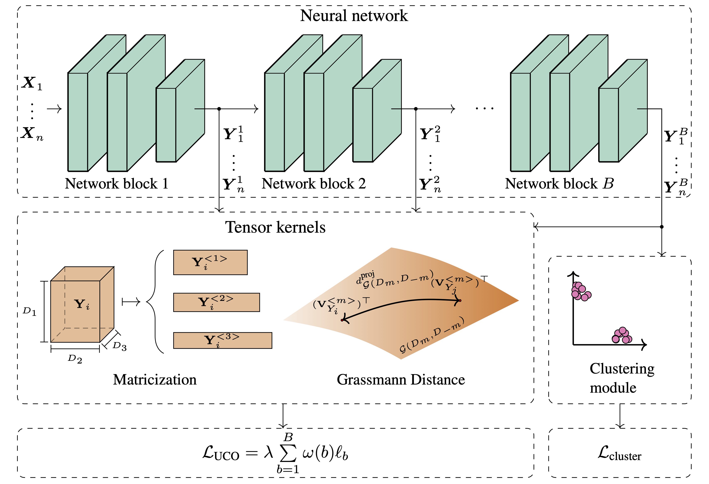

# Leveraging Tensor Kernels to Reduce Objective Function Mismatch in Deep Clustering

This repository contains the code for the paper _"Leveraging Tensor Kernels to Reduce Objective Function Mismatch in Deep Clustering"_.

**Abstract:**

_We investigate the impact of objective function mismatch in deep clustering.
We find that the popular autoencoder-based approach to deep clustering can lead to both reduced clustering performance, and a significant amount of mismatch between the reconstruction and clustering objectives.
To reduce the mismatch, while maintaining the structure-preserving property of an auxiliary objective, we propose a set of new auxiliary objectives for deep clustering, referred to as the Unsupervised Companion Objectives (UCOs).
The UCOs rely on a kernel function to formulate a clustering objective on intermediate representations in the network.
Generally, intermediate representations can include other dimensions, for instance spatial or temporal, in addition to the feature dimension.
We therefore argue that the naïve approach of vectorizing and applying a vector kernel is suboptimal for such representations, as it ignores the information contained in the other dimensions.
To address this drawback, we equip the UCOs with structure-exploiting tensor kernels, designed for tensors of arbitrary rank.
The UCOs can thus be adapted to a broad class of network architectures.
Our experiments show that the mismatch between the UCOs and the main clustering objective is lower, compared to a similar autoencoder-based model.
Further, we illustrate that the UCOs improve the clustering performance of the model, in contrast to the autoencoder-based approach._


_Figure 1:_ Overview of the proposed approach. A deep clustering model is augmented with the proposed unsupervised companion objectives (UCOs). This model uses tensor kernels to estimate the CS-divergence between clusters at the block outputs. The estimate is then used in the computation of the UCOs.


## Datasets

The USPS dataset is included in this repository.

MNIST and Fashion-MNIST can be generated by running
```bash
python -m data.make_dataset mnist fmnist
```
in the `src` directory.

The COIL-100 dataset requires the images to be downloaded from [here](https://www.cs.columbia.edu/CAVE/software/softlib/coil-100.php), and placed in `data/raw/coil100`.
The training-ready dataset can then be generated by running
```bash
python -m data.make_dataset coil100
```

## Running experiments
Experiments are started by running `src/train.py` with the desired config:
```bash
python train.py --config <config_name>
```
`<config_name>` is the name of an experiment config. All configs used to produce the results in this paper are included in `src/config/experiments` and `src/config/dec/experiments`.
For instance, to run an experiment with DDC-UCO on MNIST, the command is:
```bash
python train.py --config ddc_uco_mnist
```

### Logging
Experiment metrics (losses, ACC and NMI, as well as objective function mismatch) are logged to the console and to Weights and Biases. The WandB project name is specified by setting `WANDB_PROJECT` in `src/config/constants.py`.

### Tensorflow vs. PyTorch models
Note that some models are implemented in Tensorflow and some in PyTorch. This is because the eigen-decomposition was found to be significantly faster in Tensorflow compared to PyTorch. For consistency, all results in the paper were obtained using the Tensorflow-based models.

### Running experiments with docker
The `docker` directory contains a Dockerfile which can be used to create a custom image with all dependencies required to run experiments. The image can be built by running `docker/build.sh`.
